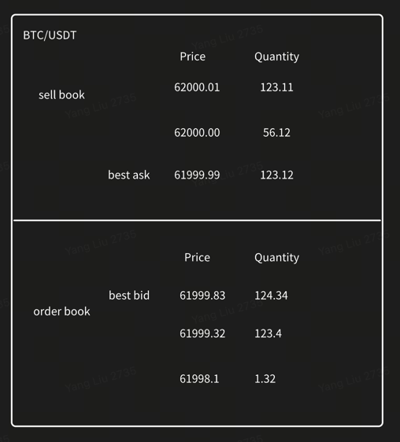

# OrderBook

#### order book is a critical component mainly used by hedge fund, exchange and crypto trading company, trader will use streaming data based on the real-time order book to generate trade signal, then decide send order or not.

### what's L1/L2/L3 order book
#### L1

#### L2

#### L3

# Implementation
## brief
#### This is an low latency L3/L2 level order book component mainly use cpp to implement (only support limit order now).
## data structure
#### typically order book data structure use double linked list save every price level info and use unorder map to save the relationship of order id and order. because best bid and offer is a important info, so it will also use map to save all price level, we could get BBO use O(1) time to get it.
## optimization
#### this component guarantee O(1) algorithm complexity of submit/cancel/update/trade order. and try to avoid lock data structure (lock free) and memory pool to optimize performance.
## architecture diagram (soon..)

## stream data
#### mainly use generate data to test order book (src/OrderBookGenerator), it's also can buy historical data of Nasdaq ITCH data to test&improve performance, but i am poor, so i give up.

# performance report (soon... )

